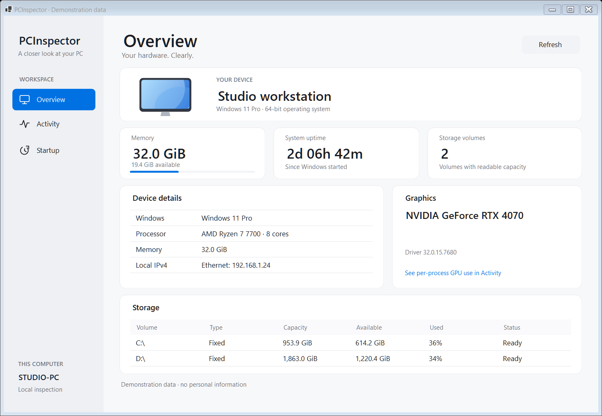
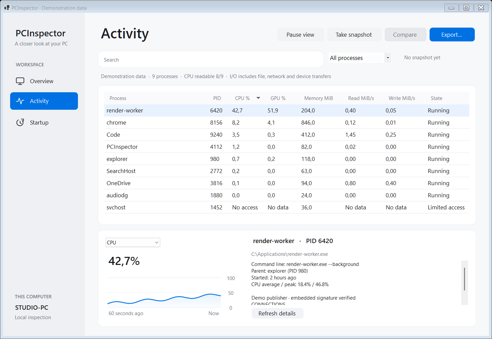

# PCInspector

A Windows diagnostics utility built with C# and .NET 10 WinForms.
Use it to inspect the computer and identify processes consuming CPU and memory.

## Features

- Computer name and Windows edition, architecture, version and build.
- CPU model name(s).
- Graphics adapter names and driver versions, including multiple adapters.
- Total physical memory usable by Windows and currently available RAM.
- Local drive letters, drive types, total size and free space.
- IPv4 addresses of active network adapters, including VPN and virtual adapters.
- System uptime since the Windows boot time.
- Refresh button, background collection and partial results when a section fails.
- Live process list: CPU%, working-set RAM, PID and executable path.
- Sortable numeric columns, GPU%, average/peak CPU and per-process samples for the last minute.
- Process command line, parent process, start time and investigation details.
- File publisher, signature status and SHA-256 hash for an accessible executable.
- Active TCP/UDP endpoints grouped by process PID.
- Startup entries from Run keys, automatic services and scheduled tasks.
- Right-click a process to show its executable selected in File Explorer.
- Right-click a process to open Task Manager and select the same PID in Details.
- JSON/HTML export of the current process table and its CPU history.
- Fluent-inspired light theme with summary cards, rounded panels and quieter tables.





The screenshots use demonstration hardware, process names, paths and readings.

## Inspect a busy computer

Open **Processes**, wait for two samples, then sort by **CPU %**, **GPU %** or **RAM MiB**.
Select a row to inspect its CPU history and copy the full executable path from the box below.
The details panel also shows the command line, parent process, start time, file signature,
SHA-256 and active network endpoints for the selected PID.
Right-click a process and choose **Show file in folder** to locate its executable without running it.
The item is disabled for unavailable or missing files. The menu keeps the clicked process's path
even if the table refreshes while the menu is open.
Choose **Open in Task Manager** to open the Details page and select the clicked process by PID.
This uses Windows UI Automation because Task Manager has no documented command-line switch for
selecting a process. If a particular Windows build does not expose its process rows to UI Automation,
Task Manager still opens and PCInspector reports that the row could not be selected.
Use **Avg %** and **Peak %** to find sustained load and recent spikes over the last 60 seconds.
Use the **Startup** tab to review persistence locations before changing anything.
**Export report** saves the visible process evidence as JSON or HTML.
The first minute fills gradually; the detail line shows the actual measured duration.

Sampling runs about once a second while the application is open, including on the System tab.
CPU% is processor time divided by elapsed time and the logical processor count reported to
PCInspector. It measures time, so it may differ from Task Manager's frequency-adjusted figures.
RAM is the working set, including shared pages; it is not private memory or a sum of system RAM.

Missing process values have explicit labels: **Waiting** for a second CPU sample,
**No access** for unavailable process details, **No samples** for empty history, and
**Not seen** for a process absent from the latest scan. Numeric sorting always places missing
values after measured values, in both directions. Protected processes may have no path or CPU
reading. **Not observed** means a process was absent from the latest successful scan;
its history remains for up to 60 seconds. PID and start time distinguish separate process lifetimes.
Processes that start and exit between scans may be missed. Sampling gaps longer than the 60-second history window are
excluded from CPU calculations, and averages use only valid measured intervals, weighted by time.
History is held in memory and disappears when the app closes.

High load is a lead for investigation, not a malware verdict. GPU Engine counters,
WMI metadata, IP Helper tables and Windows registry/service/task data can be unavailable
without the required permissions or on unsupported Windows builds. PCInspector does not
guarantee detection of hidden malware and does not modify or terminate processes.

## Requirements

- Windows 10 or Windows 11.
- [.NET 10 SDK](https://dotnet.microsoft.com/download/dotnet/10.0) to build and run from source.
- Optional: Visual Studio with .NET 10 support and the **.NET desktop development** workload.
- Internet access for the first NuGet restore (`System.Management`).

Normal use does not require administrator privileges. PCInspector reads local information;
it does not upload reports or change system settings.

## Run

From the repository directory:

```powershell
dotnet restore PCInspector.sln
dotnet build PCInspector.sln --configuration Release --no-restore
dotnet run --project src/PCInspector --configuration Release --no-build
```

Alternatively, open `PCInspector.sln` in Visual Studio and press **F5**.

## Project structure

```text
PCInspector.sln
src/PCInspector/
  Program.cs                    Application entry point
  MainForm.cs                   Refresh event and display logic
  MainForm.Designer.cs          Window layout written in C#
  FluentTheme.cs                Shared colors, typography, cards, buttons and tabs
  DisplayFormat.cs              Byte sizes and uptime formatting
  Models/SystemSnapshot.cs      Snapshot and disk data
  Services/SystemInfoService.cs Windows, drive and network queries
  ProcessesView.cs              Process table and selected history
  Models/ProcessReading.cs      Readings, process identity and CPU intervals
  Services/ProcessSampler.cs    Reads Windows processes
  Services/ProcessHistory.cs    CPU deltas and rolling 60-second history
  Services/FileLocationService.cs Opens Explorer with the executable selected
  Services/TaskManagerService.cs Opens Task Manager and selects a process through UI Automation
  Services/ProcessMetadataService.cs Reads command line and parent process metadata
  Services/GpuUsageService.cs  Reads per-process GPU Engine utilization counters
  Services/NetworkConnectionService.cs Reads TCP/UDP endpoints by PID
  Services/FileAnalysisService.cs Computes signature status and SHA-256
  Services/PersistenceService.cs Reads startup and persistence locations
  Services/ExportReportService.cs Writes JSON and HTML process reports
  StartupView.cs               Startup and persistence table
tests/PCInspector.Checks/        Executable checks without a test framework
docs/LEARNING.ru.md              Guided code walkthrough in Russian
```

The layout is defined in code; edit the layout file directly for this version.
The service does not depend on UI controls. The form awaits `Task.Run` to keep
the window responsive while WMI reads system information.

## Data sources and limitations

| Information | Source |
| --- | --- |
| Windows, RAM, boot time | WMI `Win32_OperatingSystem` |
| CPU | WMI `Win32_Processor` |
| Graphics adapter names and drivers | WMI `Win32_VideoController` |
| Command line and parent process | WMI `Win32_Process` |
| Local volumes | .NET `DriveInfo` |
| Local IPv4 addresses | .NET `NetworkInterface` |
| Per-process GPU usage | Windows PDH `GPU Engine` counter |
| TCP/UDP endpoints | IP Helper `GetExtended*Table` |
| Startup items | Registry, WMI `Win32_Service`, `schtasks.exe` |

RAM and disk sizes use GiB (1 GiB = 1,073,741,824 bytes). Usable RAM can be lower
than the physically installed RAM. Drives represent mounted volumes, not physical
SSD/HDD devices; network drives and SMART health are outside this version's scope.
An empty removable drive is displayed as **Not ready**. With no active IPv4 adapter,
the app displays **No active IPv4 addresses found**.

Uptime is calculated from WMI boot time and the current clock. Windows Fast Startup
can preserve the kernel session across shutdowns; use **Restart** to reset it.
Clock changes can affect the calculation. System-tab values update on launch and on Refresh,
not continuously. WMI failures produce warnings and preserve other sections.
WMI enumeration has a timeout, but this is not a hard deadline for the entire refresh.

## Verify

```powershell
dotnet run --project tests/PCInspector.Checks --configuration Release
dotnet run --project tests/PCInspector.Checks --configuration Release -- --live
dotnet run --project tests/PCInspector.Checks --configuration Release -- --process-live
dotnet run --project tests/PCInspector.Checks --configuration Release -- --ui
```

The first command checks formatting, CPU math, PID reuse, gaps and rolling history.
`--process-live` also checks attribution of real CPU work, RAM and the test process path.
`--ui` checks that missing values stay below numbers in both sort directions and explains missing data.
`--live` checks the real Windows
collector for required data and sensible values; it does not print machine names or IPs.
It expects a working local WMI service and at least one ready local drive.

Manual checks:

1. Compare Windows and CPU with Settings / Task Manager.
2. Compare RAM and uptime with Task Manager, allowing for sampling time and rounding.
3. Compare drive capacities with Explorer and IPv4 addresses with `ipconfig`.
4. Resize the window and click Refresh several times. The button should be disabled while reading.
5. Where available, check an empty card reader and run without an active network connection.
6. Close the window during collection; the application should exit without an error dialog.
7. Open Processes, select a process, sort by CPU or RAM and wait: selection and sorting should persist.
8. Start and close a harmless app. Its row should become Not observed and disappear after a minute.
9. Select a process and review command line, parent, signature, hash and network endpoints.
10. Open Startup and export a JSON or HTML process report.
11. Right-click PCInspector itself and choose Open in Task Manager. Check that Details selects the exact PID, or that PCInspector reports why selection was unavailable and stays responsive. Repeat with Task Manager already open and with a process that has just exited.

Task Manager integration runs in an isolated helper with a 15-second timeout. Automatic
selection depends on the Windows version, language and access level. Run the helper failure
and timeout regression checks with `dotnet run --project tests/PCInspector.Checks -- --task-manager-checks --ui`.

## Next steps

- Add IPv6 endpoint display.
- Add baseline snapshots and a diff view for repeated inspections.
- Add cancellation for long WMI and scheduled-task scans.

## Learning notes

Start with the [guided walkthrough](docs/LEARNING.ru.md).
This is a learning portfolio project; the walkthrough explains the implementation
and suggests small changes to make independently.

## References

- [Microsoft: create a WinForms application](https://learn.microsoft.com/en-us/dotnet/desktop/winforms/get-started/create-app-visual-studio)
- [Microsoft: Win32_OperatingSystem](https://learn.microsoft.com/en-us/windows/win32/cimwin32prov/win32-operatingsystem)
- [Microsoft: Win32_Processor](https://learn.microsoft.com/en-us/windows/win32/cimwin32prov/win32-processor)

## License

[MIT](LICENSE).
