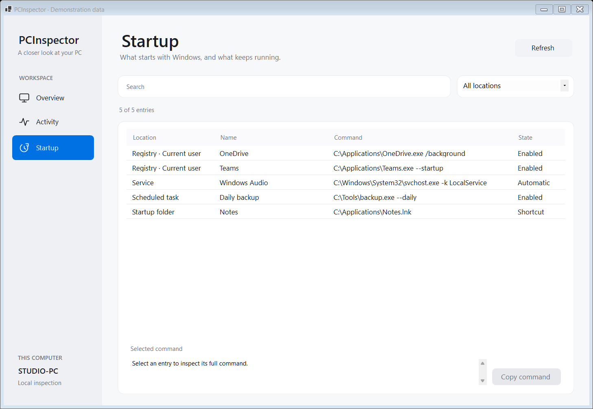

# PCInspector

A C# / .NET 10 WinForms utility for inspecting Windows hardware and investigating resource usage.
The interface takes inspiration from macOS: a quiet sidebar, clear tables and compact resource charts.
It is a Windows application and a learning portfolio project.




Screenshots contain demonstration hardware, process names, paths and measurements.

## What it does

| Page | Available information and actions |
| --- | --- |
| **Overview** | Windows version, CPU, graphics adapters and drivers, usable/available RAM, uptime, mounted volumes and local IPv4 addresses |
| **Activity** | Sortable CPU/GPU/memory and I/O measurements; search and filters; graphs for the last 60 seconds; pause, snapshots and comparison |
| **Process details** | Executable path, command line, ancestry, start time, average/peak CPU, SHA-256, embedded signature check and IPv4/IPv6 TCP/UDP endpoints |
| **Startup** | Run/RunOnce keys, startup folders, automatic services and scheduled tasks; search, source filter and copying the command |
| **Export** | JSON or HTML containing the filtered activity capture, history, available system/startup data, selected details and snapshot comparison |

Right-click a process to show its executable in Explorer, copy its PID/path, or attempt to select it in Task Manager.

## Inspect a busy computer

1. Open **Activity**, allow two samples, and sort by CPU %, GPU %, Memory MiB or I/O.
2. Search by name, PID, executable path or command line. Filters help isolate CPU/GPU load, recently started processes or limited access.
3. Select a process and choose CPU, GPU, Memory, Read I/O or Write I/O above its chart.
4. Use **Pause view** to hold the displayed capture while inspecting it. Collection continues; **Resume view** shows the latest measurements.
5. Use **Take snapshot**, wait or perform a controlled action, then **Compare**. The comparison matches PID **and start time**, showing newly observed/missing processes and metric deltas. A second snapshot replaces the baseline.
6. Review file/network details. These are separate observations with a capture time; **Refresh details** updates them explicitly.
7. Visit **Startup** to collect its entries, then **Export…** to save a report. If Startup has not been scanned, the report says so.

Snapshots cover the whole displayed capture even when a search is active. The exported activity table follows the current filter; the comparison covers the whole capture.
Processes without a readable identity are excluded from comparison. “No longer observed” does not establish that a process was terminated.

## Measurement details

- **CPU:** change in accumulated processor time divided by actual elapsed time and logical processor count. This can differ from Task Manager's frequency-adjusted percentage. Average and peak cover valid intervals within the last 60 seconds.
- **Memory:** working set, including shared pages; this is not private memory or total system memory.
- **GPU:** the busiest readable GPU engine for each process, not the sum of simultaneous engine percentages. Availability depends on Windows, the driver and counter access.
- **I/O:** process transfer bytes divided by actual elapsed time, in MiB/s. Windows includes file, network and device transfers; these columns are **not physical disk throughput**.
- **Missing data:** unavailable values stay below numbers when sorting. First samples and gaps remain unknown rather than becoming zero. A missing process retains its history for up to 60 seconds.
- **History:** collected about once a second, kept in memory for 60 seconds and cleared on exit. Brief processes between scans can be missed. Overview updates on launch and Refresh; it is not a continuous hardware monitor.

High usage is a reason to investigate, not a malware verdict.

## File, network and startup coverage

File inspection holds the file open for stable SHA-256 and WinVerifyTrust checks. Files above 512 MiB are skipped.
Verification checks an **embedded Authenticode signature offline**. Catalog signatures and online certificate revocation are not checked.
“No embedded signature” does not establish that a file is unsigned; a valid signature does not establish that it is benign.

Socket tables include IPv4 and IPv6 TCP/UDP ownership. UDP remote peers are not available from these tables.
Details are captured for the selected process identity and may become outdated after collection.

Startup covers current-user Run/RunOnce, both 32/64-bit machine Run/RunOnce keys, startup folders, automatic services and readable scheduled-task definitions.
Shortcut targets and their enabled state are not resolved. Scheduled tasks use language-independent XML, with a 12-second process timeout.
Partial collection failures are shown as warnings, not interpreted as an empty computer. WMI enumeration has a timeout, but not a hard deadline for every Windows call.

Task Manager integration runs in a separate helper with a 15-second timeout so its failure does not close the monitor.
Automatic selection depends on the Windows build, UI language and access level. When selection is unavailable, the message includes the PID for manual lookup.
The app does not terminate processes, disable startup entries, change system settings or upload reports.

## Requirements and run

- Windows 10 or Windows 11.
- [.NET 10 SDK](https://dotnet.microsoft.com/download/dotnet/10.0) to build, or .NET 10 Desktop Runtime for an already built copy.
- Optional: Visual Studio with .NET 10 support and the .NET desktop development workload.
- Internet access for the first restore of System.Management.

Normal use does not require administrator privileges, although some protected data may be unavailable.

```powershell
dotnet restore PCInspector.sln
dotnet build PCInspector.sln --configuration Release --no-restore
dotnet run --project src/PCInspector --configuration Release --no-build
```

Alternatively, open PCInspector.sln in Visual Studio and press F5.

## Project structure

```text
src/PCInspector/
  MainForm.cs / MainForm.Designer.cs   Sidebar, overview and page navigation
  FluentTheme.cs / DesktopControls.cs Shared visual style and vector controls
  ProcessesView.cs / ResourceChart.cs Activity interactions and history drawing
  StartupView.cs                      Startup search and investigation
  Models/                            Readings, identities, snapshots and reports
  Services/ProcessSampler.cs          Windows process collection
  Services/ProcessHistory.cs          CPU/I/O deltas and bounded resource history
  Services/ProcessIoService.cs        Native transfer counters with identity checks
  Services/GpuUsageService.cs         PDH GPU engine counters
  Services/ProcessMetadataService.cs  Background WMI command line and ancestry
  Services/FileAnalysisService.cs     SHA-256 and WinVerifyTrust
  Services/NetworkConnectionService.cs IPv4/IPv6 socket tables
  Services/PersistenceService.cs      Registry, folders, services and task XML
  Services/SnapshotComparison.cs      Pure comparison of known process identities
  Services/ExportReportService.cs     JSON/HTML reports with encoded text
  Services/TaskManagerService.cs      Isolated Task Manager helper
tests/PCInspector.Checks/              Executable regression checks
docs/LEARNING.ru.md                    Guided walkthrough in Russian
```

The layout is written in C#. Collectors and comparison logic do not depend on UI controls.
WMI metadata runs independently of CPU/I/O sampling, and the UI awaits background work.

## Verify

```powershell
dotnet run --project tests/PCInspector.Checks --configuration Release
dotnet run --project tests/PCInspector.Checks --configuration Release -- --ui --process-live --investigation-live --task-manager-checks
dotnet run --project tests/PCInspector.Checks --configuration Release -- --live
```

The default checks cover CPU/I/O calculations, gaps, PID reuse, GPU aggregation, network decoding, task XML, snapshot comparison and report escaping.
The combined command also exercises sorting/search/pause, real CPU and file I/O, owned IPv4/IPv6 sockets, signature verification and helper failure/timeout handling.
The `--live` hardware checks require readable WMI and a ready local drive; sandbox access restrictions can prevent them from passing.

Manual validation still matters: compare CPU/GPU readings with Windows tools, inspect every page at your DPI setting, test refresh/close during collection, and try Task Manager selection on your Windows build.
The demo screenshots are visual checks, not evidence of live hardware collection.

## References

- [WinForms getting started](https://learn.microsoft.com/en-us/dotnet/desktop/winforms/get-started/create-app-visual-studio)
- [How Task Manager measures GPU utilization](https://devblogs.microsoft.com/directx/gpus-in-the-task-manager/)
- [GetProcessIoCounters](https://learn.microsoft.com/en-us/windows/win32/api/winbase/nf-winbase-getprocessiocounters)
- [WinVerifyTrust configuration](https://learn.microsoft.com/en-us/windows/win32/api/wintrust/ns-wintrust-wintrust_data)
- [IPv6 process-owned TCP rows](https://learn.microsoft.com/en-us/windows/win32/api/tcpmib/ns-tcpmib-mib_tcp6row_owner_pid)
- [Scheduled-task queries](https://learn.microsoft.com/en-us/windows-server/administration/windows-commands/schtasks-query)

## Learning and license

Read the [guided walkthrough in Russian](docs/LEARNING.ru.md). Licensed under [MIT](LICENSE).
